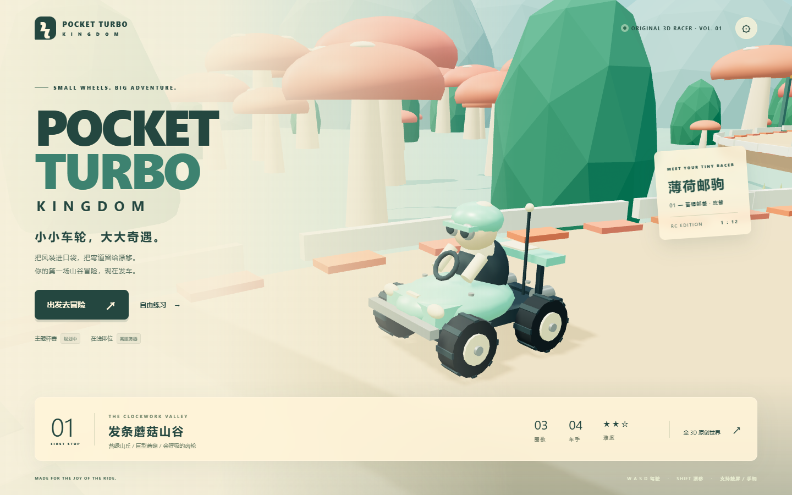
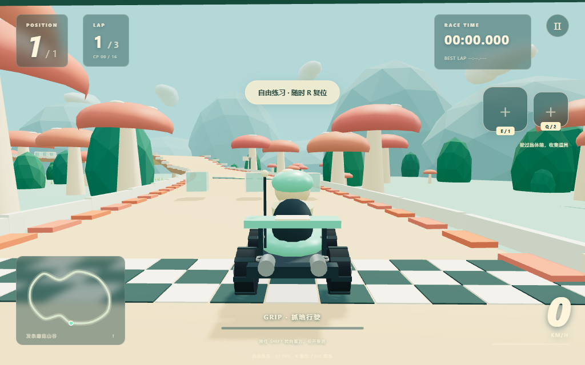
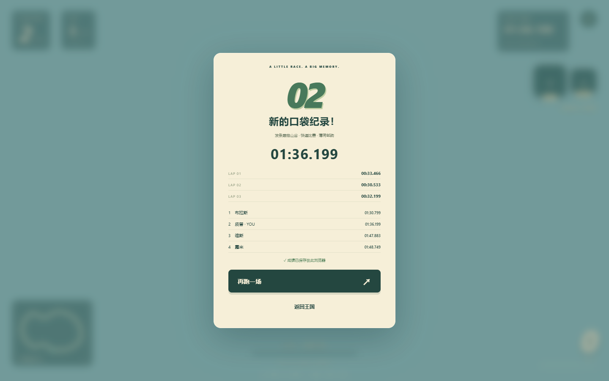
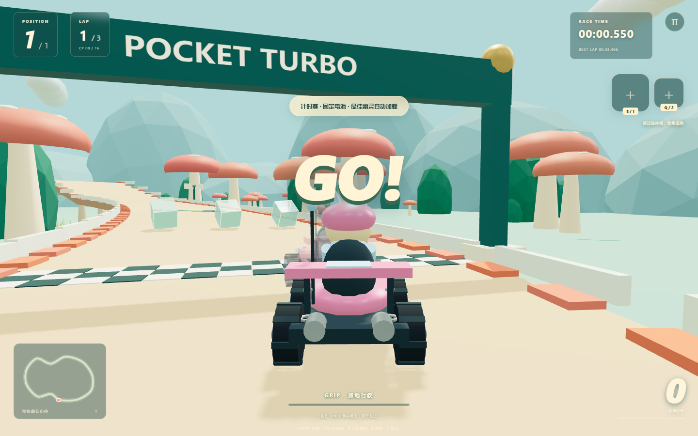
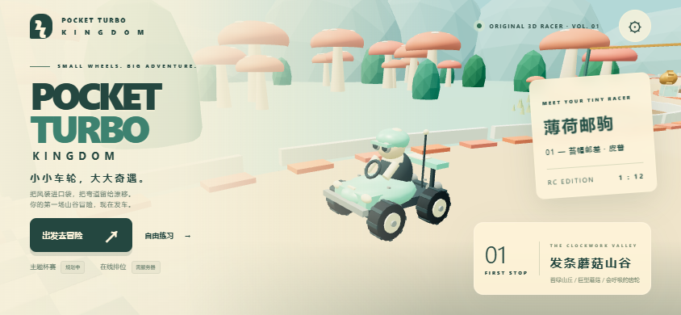
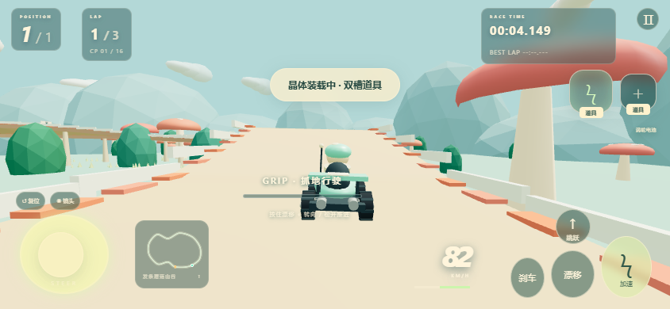

# Pocket Turbo Kingdom（口袋涡轮王国）

> 卡通幻想风 RC 玩具车 3D 竞速网页游戏 —— 真实 3D 几何 + 真实物理，浏览器里直接开跑。


| 主菜单 | 竞速中 |
|---|---|
|  |  |

| 结算 | 计时幽灵 | 手机菜单 | 手机多点触控 |
|---|---|---|---|
|  |  |  |  |

## 玩法

- **局域网多人竞技**：2–4 名真人、6 位房间码、选车与准备、房主发车，服务器统一物理 / 道具 / 排名；支持掉线处理和再来一场
- **完整竞速闭环**：主菜单 → 选车 → 3 圈竞速（3 名 AI 对手）→ 结算排名
- **开放竞技场道具乱斗**：新增「星火玩具竞技场」，3 分钟自由驾驶、晶体道具补给和掩体，道具命中对手 +1 分，同分并列；支持 2–4 人局域网与单人对战 3 名 AI
- **计时模式**：单人 3 圈计时，10 Hz 幽灵回放，本地最佳单圈 / 总圈记录
- **4 种原创道具**：
  - 🔋 电池 —— 冲刺加速
  - 🍌 果皮 —— 放置路障，命中打滑
  - ⚙️ 齿轮 —— 弹射飞盘，一次反弹
  - ✨ 萤火虫 —— 追踪导弹，锁定前方对手
- **漂移 / 跳跃 / 特技**：漂移蓄力松开获得推进，坡道起飞空中可转向
- **低角度追尾镜头**：贴地视角、射线防穿墙、速度 FOV、撞击震动

## 操作

| 动作 | 键盘 | 手柄 | 触屏 |
|---|---|---|---|
| 加速 / 刹车 | W / S | RT / LT | 油门 / 刹车 |
| 转向 | A D / ← → | 左摇杆 | 左摇杆 |
| 漂移 | Shift | LB | 漂移键 |
| 跳跃 | 空格 | A | 跳跃键 |
| 道具 1 / 2 | Q / E | X / Y | 道具键 |
| 暂停 / 重置 | Esc / R | Start / B | 暂停键 |

## 快速开始

```bash
npm install
npm run dev        # 游戏 + 局域网 WebSocket 服务器（默认 http://localhost:5173）
npm run lan        # 同上；终端显示可分享的局域网地址
npm run build      # 类型检查 + 生产构建
npm run preview    # 仅预览静态生产构建，不包含联机服务器
```

## 局域网一起玩

1. 主机安装 Node.js 22+，运行 `npm install`、`npm run lan`，保持终端开启。
2. 所有设备连接同一路由器 / Wi-Fi，在浏览器打开终端打印的局域网网址（例如 `http://192.168.1.10:5173`）。主机自己也可以打开该网址。
3. 主菜单点击 **局域网竞技**，填写昵称并选车。一人创建房间，其他人输入 6 位房间码加入。
4. 房主选择 **山谷竞速** 或 **星火竞技场 · 道具乱斗**；切换模式会清除所有人的准备状态。至少 2 人、最多 4 人，所有人点击 **准备** 后，房主点击发车。
5. 乱斗模式限时 3 分钟，使用道具命中对手 +1 分（自伤不计分、无敌期间不重复计分）；同分并列，掉线玩家退出排名竞争。复位冷却 8 秒。竞速模式跑三圈；首位冲线后最多再等 60 秒，或比赛达到 10 分钟统一结算。未完成三圈的车手记为未完赛。房主可以返回房间，大家重新准备再开一场。

联机时 Esc 不暂停比赛；左上角可退出房间。房主离开会将房主身份交给下一位在线玩家。掉线玩家本局无法重连，下一场可重新加入。主机进程关闭会断开所有房间。若无法访问，请确认系统防火墙允许 Node.js 的 5173 端口，Wi-Fi 未开启访客隔离。可用 `PORT=5180 npm run lan` 更换端口（macOS / Linux）。

服务器使用现有 Rapier 物理和道具系统，客户端只发送操作；60 Hz 模拟、30 Hz 输入、20 Hz 状态同步与画面插值。当前面向可信局域网，不提供公网账号、排位或持久化房间。服务器代码修改后需重启 `npm run lan`。

## 测试

```bash
npm test           # 27 个单元/集成测试（固定步长、检查点、道具权重、Rapier 悬挂/漂移/4 车 AI 完赛、存档容错、杯赛数据层）
npm run test:arena     # 先启动 npm run lan；竞技场结算、切图、手机防长按和多点触控
npm run test:lan       # 先启动 npm run lan；协议 + 双浏览器联机测试
npm run test:browser   # Playwright 真实浏览器端到端（34 项检查）
```

浏览器端到端覆盖：键盘 / 手柄 / CDP 真实多点触控三种输入各跑完 3 圈、
**屏幕左右方向回归**（用 Three.js 实际相机投影验证 D = 屏幕右、A = 屏幕左，键盘/手柄/触屏三通道）、
幽灵录制与重载恢复、道具使用与防连发、手动重置、画布缩放、竖屏无溢出、零控制台错误。

## 技术栈

- **Three.js 0.174** —— 渲染；全程序化低多边形资产（赛道、卡丁车、蘑菇/树/城堡布景），零外部美术资源
- **Rapier 3D (WASM)** —— 刚体 + 4 射线悬挂 + 碰撞；60 Hz 固定步长物理
- **TypeScript + Vite** —— 严格类型，构建产物约 145 KB gzip（不含 Rapier WASM）
- **Web Audio** —— 程序化引擎声与音效，无音频文件
- **localStorage** —— 分模式分车辆记录、幽灵帧、设置；损坏数据自动清洗

## 目录结构

```
src/
  core/        Game 主循环、固定步长
  track/       CatmullRom 闭环赛道、坡道、弯道、捷径、检查点
  vehicle/     Rapier 卡丁车物理、程序化模型
  ai/          样条跟随 + 曲率刹车 + 橡皮筋 AI
  items/       双槽道具系统、对象池
  camera/      低角度追尾镜头
  input/       键盘 / 手柄 / 多点触控
  ui/          菜单、HUD、小地图、结算
  effects/     实例化粒子
  audio/       Web Audio 引擎
  storage/     本地记录
  network/     WebSocket 客户端、房间界面、共享消息协议
  modes/       杯赛数据层（测试用扩展）
server/        60 Hz 权威物理、房间管理、20 Hz 状态广播
tests/         Vitest 单元 + 物理集成测试
scripts/       Playwright 浏览器端到端
```

## 质量档位

低 / 中 / 高三档：像素比上限、阴影、粒子密度、布景数量自动切换；移动端自动降档。

## 许可

MIT。所有 3D 资产、道具、角色均为原创程序化生成，不含任何任天堂素材。

## 关键词

`three.js` `rapier` `wasm` `kart-racing` `arcade-racing` `webgl` `typescript` `vite` `game` `3d-racing` `drift` `ai-opponents` `ghost-replay` `procedural-assets` `mobile-touch` `gamepad`

联机浏览器测试需要 Playwright Chromium（`npx playwright install chromium`），也可使用已安装的 Edge：`PTK_BROWSER_CHANNEL=msedge npm run test:lan`。

手机游戏区域已禁用文字选择、长按菜单与控件上的浏览器手势；昵称 / 房间码输入框仍可编辑，房间内分享地址和房间码仍可复制。竞技场联机测试：`PTK_BROWSER_CHANNEL=msedge PTK_LAN_MODE=arena node scripts/lan-test.mjs`。
