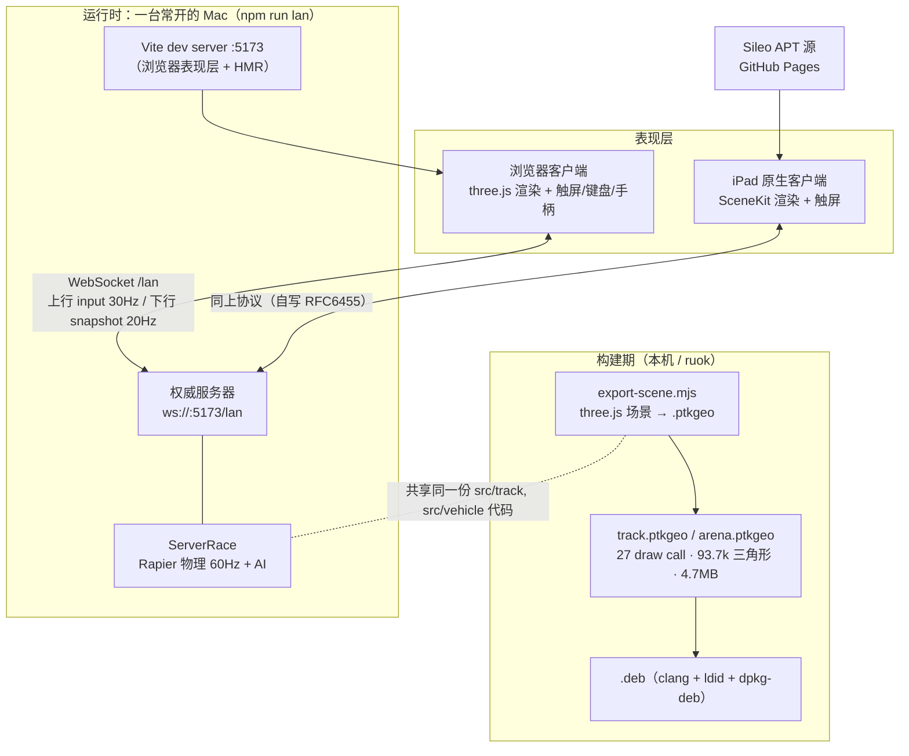

# Pocket Turbo Kingdom · 系统架构

> 卡通幻想风 RC 玩具车竞速游戏。**一套仿真内核，三种运行形态**：浏览器客户端、iPad 原生客户端、
> 以及两者共用的 Node 权威服务器。本文说明功能划分、数据流与关键技术选择。

---

## 1. 为什么是这个架构（约束先行）

架构不是先设计出来的，是被三条硬约束逼出来的：

| 约束 | 事实 | 架构后果 |
|---|---|---|
| **iPad mini 2 / A7 / 1GB / iOS 12.5.8** | 实测只有 **WebGL 1**（three r163+ 已删 WebGL1）、**WASM 仅 MVP**（无 bulk-memory / sign-ext / nontrapping-fptoint / SIMD） | Rapier 的 WASM 在 iOS 12 上**编译不了** → 本地物理路线死掉 → 改**服务器权威 + 薄客户端** |
| **要能和朋友一起玩** | 浏览器版已有局域网联机 | 天然要求「协议与物理只有一份」→ 服务器跑物理，客户端只渲染 |
| **要复用已有美术与玩法** | 赛道/赛车/道具/HUD 全在 three.js 里 | 表现层按平台各写一份，但**几何从同一份 three.js 场景烘焙导出**，保证与物理赛道严格对齐 |

一句话：**仿真在 Node（Rapier WASM 在 Node 里完全可用），表现层各平台自负其责。**

---

## 2. 部署拓扑与进程



运行形态只有两种：**服务器**（唯一权威）和**客户端**（可替换）。浏览器与 iPad 在同一房间里是**对等客户端**，
服务器不区分它们——这正是「iPad 版和 Web 版能同房对战」的原因。

---

## 3. 功能划分（五块）

### 3.1 共享仿真内核 `src/`（796 行 TS，浏览器与服务器跑同一份）

| 模块 | 行数 | 职责 |
|---|---|---|
| `track/Track.ts` | 138 | 12 控制点 Catmull-Rom 赛道：采样、投影、路面/路肩/护栏几何、道具箱与加速带锚点、捷径 |
| `track/Arena.ts` | 135 | 竞技场：固定碰撞块 + 视觉装饰（浏览器与服务器**同一函数**建碰撞体） |
| `vehicle/KartPhysics.ts` | 82 | 街机车辆模型：4 轮悬挂射线、漂移蓄力、加速带、特技、受击 |
| `items/ItemSystem.ts` | 63 | 4 种道具的对象池、投掷、反弹、追踪、命中判定 |
| `ai/AIDriver.ts` / `ArenaDriver.ts` | 21 / 61 | 寻线驾驶 / 追击+拾取决策（返回 `Controls`，与真人输入同构） |
| `race/RaceManager.ts` | 46 | 检查点、圈数、名次、结算 |
| `core/FixedStep.ts` | 10 | 固定步长累加器 |

**这块是整个架构的支点**：AI 的输出类型就是 `Controls`，与真人输入**完全同构**，
所以「AI 车手」和「真人车手」在物理层没有区别（这也是后来能低成本加「单人打 3 个电脑」的原因）。

### 3.2 权威服务器 `server/`（453 行）

| 文件 | 行数 | 职责 |
|---|---|---|
| `index.ts` | 294 | HTTP+WS 接入、房间生命周期（创建/加入/准备/发车/再来一场）、输入校验与限流、保活、20Hz 广播、单人模式补 bot |
| `Race.ts` | 159 | `ServerRace`：把共享内核跑在服务器上，驱动 bot，产出 `Snapshot` |

### 3.3 浏览器表现层

`src/ui/HUD.ts`（DOM 覆盖层）、`src/camera/ChaseCamera.ts`、`src/effects/`、`src/network/LanClient.ts`（299 行，含大厅 UI）、`src/input/InputManager.ts`（键盘/手柄/多点触控统一成 `Controls`）。

### 3.4 iPad 原生表现层 `ios/PocketTurboKingdom/client/`（3595 行 ObjC）

| 模块 | 行数 | 职责 |
|---|---|---|
| `Net/PTKWebSocket.m` | 812 | **自写 RFC6455**（握手/掩码/分片/ping-pong/close/心跳） |
| `Net/PTKProtocol.m` | 340 | 协议 v2 结构化编解码 + 上行消息构造 |
| `Render/PTKTrackData.m` | 387 | `.ptkgeo` → `SCNGeometry`/`SCNMaterial`；CoreText 画指示牌贴图 |
| `Render/PTKKartNode.m` | 243 | 用 SceneKit 图元复刻赛车 + 动画（轮转/悬挂/尾焰/无敌闪烁） |
| `Render/PTKWorldBuilder.m` | 163 | 道具箱、移动障碍、飞行道具、赛道采样点查询 |
| `UI/PTKTouchControls.m` | 210 | 虚拟摇杆 + 6 个按钮 → `Controls` |
| `UI/PTKLobbyView.m` / `PTKHUDView.m` | 350 / 226 | 大厅（建房/加入/单人）与比赛 HUD |
| `GameViewController.m` | 779 | 场景装配、快照插值、追尾相机、联机状态机 |

### 3.5 构建期资产管线 `ios/export/export-scene.mjs`

在 **Node 里**（不是浏览器）构造真实的 `Track`/`Arena`，遍历 three.js 场景图烘焙成 `.ptkgeo`。
这是「一份几何，两端一致」的实现手段（详见 §5.6）。

---

## 4. 数据流：一帧的完整生命周期

```
[服务器] 每 16.7ms（60Hz）          [客户端] 每帧（目标 60fps）
  ├ 收集 inputs（无输入→空控制）      ├ 读触屏/键盘/手柄 → Controls
  ├ 驱动 bot（AIDriver.update）       ├ 每 33ms 上行一条 input{seq, controls}
  ├ world.step()（Rapier 1/60）       │
  ├ 每 3 tick（20Hz）广播 snapshot ────┼→ 收到 snapshot：previous ← current
  │   · karts[位置/速度/偏航/圈/名次]  │              position ← 新值
  │   · items[池下标/种类/位置]        ├ 渲染：以 alpha=min(1, Δt/50ms) 在
  │   · boxes[15 个道具箱冷却]         │   previous→current 之间插值
  └ 每 5s ws.ping() ─────────────────→└ 必须回 pong，否则 5s 内被 terminate
```

关键数字（都实测）：

| 项 | 值 | 说明 |
|---|---|---|
| 物理步长 | 1/60 s | `world.timestep`，服务器定时器 60Hz 推进 |
| 快照频率 | 20 Hz | `tick % 3` 才发；每帧全量状态（约 2–4 KB JSON） |
| 上行输入 | 30 Hz | iPad 客户端 33ms 一条；服务器 500ms 无输入则清空该玩家控制 |
| 插值窗口 | 50 ms | `alpha = min(1, 距上次快照 / 50ms)`，两端用的是同一公式 |
| 保活 | 5 s ping / 5 s 超时 | 服务器 ping，无 pong 即断；客户端另有 15s 无数据兜底 |
| 消息上限 | 4096 B / 帧，600 条 / 5 s | 服务器侧限流 |

**刻意不做客户端预测与回滚**：整个模型是「服务器算准 → 客户端插值呈现」。
好处是两端永远一致、代码量小；代价是手感受网络延迟直接影响（同网 <5ms 无感，跨省会发飘）。

---

## 5. 关键技术

### 5.1 单一仿真内核 + 服务器权威
浏览器与服务器 `import` 同一批 `src/**` 模块。物理只在服务器跑一次，
浏览器在单机模式下才本地跑同一份代码（AI 也在本地）。
**代价**：服务器是单点；**收益**：不存在两套物理对不齐的问题。

### 5.2 输入语义：边沿锁存
`jump / item1 / item2 / reset / discard` 在服务器侧是 `next[k] ||= prev[k]` —— 一旦为 true 会**保持**，
直到客户端显式发 `false`。所以客户端必须在下一帧把一次性按键回置 false，否则会连发。
iPad 端的做法：`pollControls` 返回后立即清空一次性标志 → 「按下只生效一帧」。

### 5.3 保活与自写 RFC6455
服务器每 5s `ws.ping()`（**空 payload**），不回 pong 直接 terminate。这在 iPad 端意味着
**不能只实现文本帧**，必须完整处理控制帧、掩码、7/16/64 位长度、分片。
为什么自写而不用库：iOS 12 没有 `URLSessionWebSocketTask`（iOS 13+），而引第三方库会带来签名与体积问题。
踩到的坑（已写在代码注释里）：macOS 上 `CFStream` 在 `Open` 之前 `SetClient` 会死锁；
`CFWriteStream` 不派发 `CanAcceptBytes`；`Sec-WebSocket-Accept` 冒号后的空格必须单独 trim。

### 5.4 服务端 AI（单人模式）
`Player.bot?: boolean`。房主单独发车时服务器补 3 个 bot：
AI 返回 `Controls` → 与真人输入走同一条物理管线；结算条件把 bot 计入。
大厅回退时过滤 bot，房间人数语义保持干净。**客户端零改动即可支持**（只是多渲染几辆车）。

### 5.5 设备能力探测 → 路线决策
在 iPad 上用 Safari 打开探测页，把结果回传：WebGL1 ✅ / WebGL2 ❌ / WASM 仅 MVP / GPU "Apple GPU"。
这份数据直接决定了「不做 WebView 套壳，改原生 SceneKit」——**先测量，再选路线**。

### 5.6 几何烘焙：`.ptkgeo`
`export-scene.mjs` 在 Node 里构造场景后逐节点烘焙：

- **合并 InstancedMesh**：700 根草 + 390 个斑点若各自成节点 = 2505 draw call；
  按材质合并成 **27 个静态 mesh**（三角形数不变，93,766）。这是 A7 能跑的前提。
- **烘焙世界变换**：客户端一个节点一次 draw call，不做场景图求交。
- **LOD 只取 level 0**；canvas 贴图的指示牌不导几何，改存 `{text, 尺寸, 颜色, 变换}`，
  客户端用 CoreText 重绘（跨平台，且文字在 Retina 上更锐）。
- **颜色**：three 工作空间是 Linear-sRGB，导出时统一转 sRGB（SceneKit 默认 sRGB 管线）。
- **flatShading 材质**（低多边形树/山）先 `toNonIndexed` 再算法线，保持面块感。
- 附带导出**动态锚点**：道具箱位置、移动障碍的锚点+方向、加速带、起点、赛道采样点（用于倾斜与小地图）。

### 5.7 SceneKit 侧的关键坑

| 坑 | 现象 | 解法 |
|---|---|---|
| `SCNGeometry.materials` **属于几何而非节点** | 复用同一 `SCNBox` 实例的部件全部显示成最后赋的材质（车身变座椅色） | 每个部件 `[geometry copy]` |
| 每部件一个节点 = 上百 draw call | A7 上帧率崩 | `flattenedClone` 按材质合并车身/轮子（≈18 → 6 draw call/车） |
| PBR 太重 | 首帧着色器编译慢、GPU 吃紧 | 全部改 `SCNLightingModelBlinn` |
| **单参数 `lookAt:` 会继承节点当前 `worldUp`** | 每帧调用会把微小倾斜**累积**成滚转，地平线越来越歪（实测 600 帧累积到 **−27.9°**） | 改三参数 `lookAt:up:localFront:`，每帧强制世界垂直 → **+0.03°** |

### 5.8 iOS 12 平台的其它硬约束

- `CGColorCreateGenericRGB` 是 **iOS 13+**：iOS 12 上是弱符号 NULL，**真机一调即崩** → 改 `CGColorCreate(colorSpace, comps)`。
- **启动看门狗（0x8badf00d）**：A7 上「解析 4.7MB 几何 + SceneKit 首次编译 27 个着色器」超过 SpringBoard 给的 5 秒会被杀。
  → `viewDidLoad` 只建窗口与 UIKit 覆盖层，重活**推迟 0.2s 到首帧之后**。
- **锁屏状态下无法远程启动应用**（`uiopen` 静默失败），远程调试要先解锁。

### 5.9 分发：不打 Xcode 工程
`clang（iPhoneOS SDK, -miphoneos-version-min=12.0）→ ldid 假签名 → dpkg-deb -Zxz → .deb → Sileo`，
源是 GitHub Pages 上的 APT 仓库。设备已越狱，因此**不受 7 天签名限制**，也不需要 `xcodeproj`。

### 5.10 五层测试与远程可观测

| 层 | 手段 | 现有量 |
|---|---|---|
| 共享内核单测 | vitest（含「单人跑 4 车」等） | **29 项** |
| 协议/联机 | `lan-protocol-test.mjs`（ws 裸客户端 + 房间语义）、`lan-test.mjs`（双浏览器真赛） | 全过 |
| 原生协议层单测 | `tests/run_tests.sh`：帧编解码 61 + 协议解析 92 断言 | **153 项，作为打包门槛** |
| 原生 UI 回归 | `tests/run_ui_tests.sh`：iPad 模拟器，多尺寸布局不重叠、摇杆映射/死区/隐藏态/resize | PASS |
| 端到端联调 | `tools/lanreplay.m`：macOS 无头双客户端连真实服务器跑一场并渲帧 | 358 帧快照 |

另外两个**只能靠 SSH 触发**的远程钩子（iPad 上接不了调试器）：
`/tmp/ptk-capture` → 每秒把「3D+UI 合成画面」写成 PNG；`/tmp/ptk-autotest`（必须 `PTK-AUTOTEST|` 前缀）→ 自动联机/发车，加 `|drive` 才自动驾驶。

---

## 6. 实测性能账

| 指标 | 值 |
|---|---|
| 三角形 / draw call | 93,766 / **27**（赛道） |
| 几何文件 | 4.73 MB（track）+ 0.07 MB（arena） |
| iPad 帧率 | 大厅 **58–60 fps**；1 人 + 3 AI 比赛中 **50–60 fps** |
| 常驻内存 | ≈ 50 MB（1GB 设备） |
| 首批加载 | 几何解析 ≈ 60–120 ms（Mac 上测），真机受启动看门狗约束 |
| 局域网 RTT | 17 ms（同一 Wi-Fi，iPad 侧 HUD 显示） |

---

## 7. 已知取舍与后续可做

| 取舍 | 影响 | 若要走另一条路 |
|---|---|---|
| 薄客户端（物理在服务器） | **离机不可玩**：Mac 必须开着且在同一网络 | ① 服务器搬到常开机（含公网 + iPad 走 4G）；② 把物理移植到 iPad（SceneKit 物理或手写），AI 也搬过来 |
| 无客户端预测 | 高延迟下操作发飘 | 加输入预测 + 服务器回滚（需确定性物理，成本高） |
| 快照全量 JSON | 20Hz × 4 车 ≈ 2–4 KB/帧，够用但不经济 | 改二进制/增量压缩（同网无必要） |
| 表现层分两套 | iPad 端要跟着改 | 已用「几何烘焙 + 协议共用」把重复压到最小 |

---

## 附：仓库地图

```
pocket-turbo-kingdom/
├── src/                    共享仿真内核 + 浏览器表现层（three.js）
│   ├── core/ track/ vehicle/ items/ ai/ race/ input/ config/   ← 仿真（服务器也用）
│   └── ui/ camera/ network/ effects/ audio/ storage/           ← 仅浏览器
├── server/                 Node 权威服务器（HTTP + WS + Vite 中间件）
├── scripts/                lan.mjs（打包服务器并启动）、各类联机测试
├── ios/
│   ├── DESIGN.md           原生客户端设计（协议契约 / .ptkgeo 格式 / 里程碑）
│   ├── export/             几何烘焙
│   └── PocketTurboKingdom/ iPad 客户端 + 构建脚本 + 测试 + 工具
└── docs/                   本文件与截图
```
